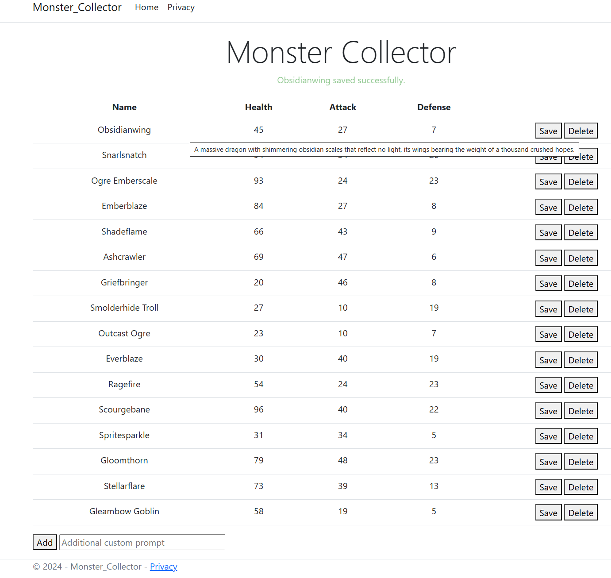

Monster Collector
=================

A simple VSCode C# .NET 8.0 web application using MVC, Razor, EntityFramework, and Sqlite to store a list of monsters.

Monster names and descriptions are generated by an AI large language model (LLM) using [Cohere](https://cohere.com).

The table of monsters utilizes the `contenteditable` HTML attribute to allow inline editing of monster details. An ajax [call](Monster%20Collector/wwwroot/js/site.js) triggers the save to an API method on the backend.

Includes an audit log of all changes to records in the database, available by hovering your mouse over any row in the table.

## Quick Start

Install the required libraries in VSCode before running the project.

1. Open a Terminal in VSCode.
2. `dotnet add package Microsoft.EntityFrameworkCore.Design`
3. `dotnet add package Microsoft.EntityFrameworkCore.Sqlite`
4. `dotnet tool install --global dotnet-ef`
5. Create a file `Monster Collector/.env` with the line `CohereApiKey=<YOUR_API_KEY>`

*You can register a Cohere API key [here](https://dashboard.cohere.com/api-keys).*

## Generate Monsters in the Database

To re-generate the monsters in the database, use the following steps.

1. Delete the files `MonsterManager.sqlite`, `MonsterManager.sqlite-shm`, `MonsterManager.sqlite-wal`.

To re-generate the entire database, use the following steps.

1. Delete the folder `Migrations`.
2. `dotnet ef migrations add InitialCreate`
3. `dotnet ef database update`

## API methods

#### GET /api/monster/{id}

Returns details for a specific monster by Id. The Id can be found in the table row `data-id` HTML attribute.

#### PUT /api/monster/{id}

Updates a specific monster by Id and payload.

#### POST /api/monster/

Generate a new monster.

#### DELETE /api/monster/{id}

Deletes a specific monster by Id.

## License

MIT

## Author

Kory Becker http://www.primaryobjects.com/kory-becker